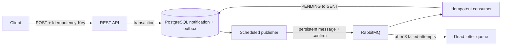

# Spring Notifications

[](https://github.com/Stepanda1/Spring-app/actions/workflows/verify.yml)

A Spring Boot API that accepts notifications, stores them in PostgreSQL and processes them asynchronously through RabbitMQ. Built from an earlier RabbitMQ learning example into a runnable backend portfolio project.

**Java 17+ · Spring Boot 3.5 · PostgreSQL · RabbitMQ · Flyway · Docker Compose**

## Run

Requires Docker with Compose. From the repository root:

```sh
docker compose up -d --build
```

API: `http://localhost:8088`. Readiness: `/actuator/health/readiness`. RabbitMQ UI: `http://localhost:55673` (local demo login: `notifications` / `local-demo-password`). The first build downloads dependencies.

```sh
curl -i http://localhost:8088/api/notifications \
  -H 'Content-Type: application/json' -H 'Idempotency-Key: order-42' \
  -d '{"recipient":"demo@example.com","subject":"Order ready","body":"Your order is ready."}'
```

Response: **202 Accepted** with an `id` and `Location`. Query `GET /api/notifications/{id}` until status becomes `SENT`. Reusing the key with the same payload returns the same record; a different payload returns **409**. Invalid input returns **400**, an unknown UUID **404**. [API contract](docs/openapi.yaml).

## Why it is reliable



- PostgreSQL is committed before broker publication; broker downtime leaves requests pending for retry.
- Unique keys protect concurrent submissions. Publisher confirms and returns prevent premature outbox completion.
- Duplicate messages have one database delivery effect. Durable queues and persistent Docker volumes survive restarts.

## Verify

```sh
docker compose --profile test run --rm tests
```

With the application running, PowerShell 7 executes the HTTP and failure-recovery demo:

```powershell
pwsh ./scripts/verify.ps1
```

The script temporarily stops this project's RabbitMQ and restarts its app. CI runs both checks. [Architecture and limitations](docs/architecture.md) · [Verification evidence](docs/verification.md)

## Scope

`SENT` represents **simulated delivery in the database**, not a real email. No authentication, tenant isolation or external provider is implemented. Ports bind to localhost; credentials are for local demonstration. This is a portfolio demo, not a production notification platform.

The original `tut1` sender/receiver sources remain in the Maven module. [Development instructions](docs/development.md).

Stop with `docker compose down`; add `-v` only to erase demo data.
